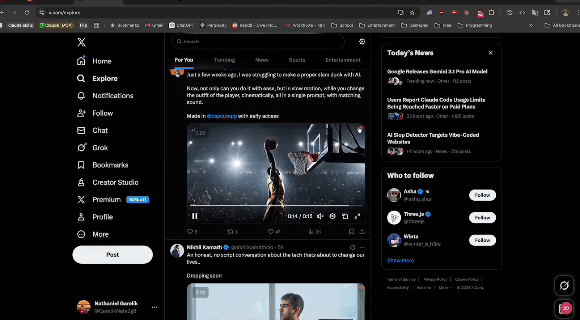
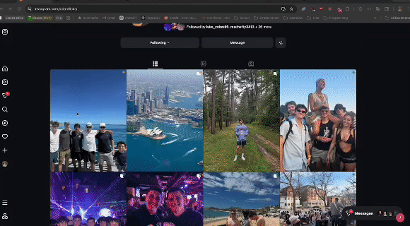

# Baloney

<p align="center">
  
</p>

<p align="center">
  <strong>Multi-modal AI content detection for the real-time web.</strong>
</p>

<p align="center">
  1st Place — MAD Data 2026
</p>

<p align="center">
  <a href="https://baloney.app">Live Demo</a> |
  <a href="https://baloney.app/analyze">Try Detection</a> |
  <a href="https://baloney.app/dashboard">Dashboard</a> |
  <a href="https://baloney.app/evaluation">Evaluation</a> |
  <a href="#quick-start">Quick Start</a>
</p>

---

## The Problem

Every major social platform is flooded with AI-generated content — synthetic text, generated images, deepfake video — and none of them tell you. The asymmetry is staggering: generating a convincing fake takes seconds and costs nothing. Recognizing one requires expertise, tooling, and time that most people don't have.

The cost of generating a lie is now zero. The cost of verifying truth shouldn't be.

Baloney closes this gap. A Chrome extension scans content as you browse nine platforms in real time, while a dashboard tracks your AI exposure over time. Community detection runs entirely local — no API keys, no data leaving your machine. Pro detection adds commercial APIs for near-perfect accuracy.

---

## Demo

<p align="center">
  
  &nbsp;&nbsp;
  
</p>

<p align="center">
  <a href="https://baloney.app/feed">Try the demo feed</a> · <a href="https://baloney.app/platform">See platform overlays</a>
</p>

---

## Detection Methods

| Method | Type | Edition | Accuracy | Source |
|--------|------|---------|----------|--------|
| Statistical Analysis (12 features) | Text | Community | ~67% | Burstiness, TTR, readability, perplexity |
| FFT / DCT Frequency Analysis | Image | Community | ~83% | Spectral uniformity, smoothness, edge density |
| EXIF / C2PA Metadata | Image | Community | Heuristic | Camera signatures, AI tool markers, provenance |
| Pangram API | Text | Pro | 99.85% | [arXiv:2402.14873](https://arxiv.org/abs/2402.14873) |
| SightEngine GenAI | Image/Video | Pro | 98.3% | ARIA benchmark #1 |
| SynthID (Google) | Text/Image | Pro | Watermark | Gemini + Imagen watermark detection |

Baloney uses a **cascading detection architecture**: high-accuracy commercial APIs run first when available. If not, the system gracefully falls back to local statistical and frequency-domain methods — no API keys required.

See the full evaluation with ROC curves, confusion matrices, and ablation studies at [baloney.app/evaluation](https://baloney.app/evaluation).

---

## What Powers the Live Demo

The [live demo](https://baloney.app) runs the **full pro ensemble** — this is what we submitted and demoed at MAD Data 2026. In the interest of transparency, here is exactly what is running:

| Service | What it does | Why we use it |
|---------|-------------|---------------|
| [Pangram](https://pangram.com) | Text AI detection | 99.85% accuracy, peer-reviewed ([arXiv:2402.14873](https://arxiv.org/abs/2402.14873)) |
| [SightEngine](https://sightengine.com) | Image and video AI detection | 98.3% accuracy, ARIA benchmark #1, 2000 free ops/month |
| [Google Vertex AI](https://cloud.google.com/vertex-ai) | SynthID watermark detection | Detects Gemini + Imagen watermarks via Google's own tooling |
| [HuggingFace Inference](https://huggingface.co) | RoBERTa text classification | Open-source model ensemble, free tier available |
| [Supabase](https://supabase.com) | Auth, database, RLS | Free tier PostgreSQL with row-level security |

The detection pipeline we built is original — the cascading architecture, scoring logic, ensemble weighting, verdict system, and all 22+ dashboard visualizations are ours. The third-party APIs above provide the raw detection signals that our pipeline orchestrates.

**When Baloney ships publicly**, the open-source community edition will use only local detection methods (statistical text analysis, FFT/DCT image analysis, EXIF/C2PA metadata). No third-party API calls, no data leaving your machine. The commercial APIs above will be available separately for users who opt into the pro edition.

---

## The Dashboard

Explore the live dashboards: [Personal Analytics](https://baloney.app/dashboard) · [Community Intelligence](https://baloney.app/dashboard/community)

### Personal Analytics

- AI exposure timeline with daily/weekly/monthly trends
- Per-platform breakdown (Instagram, X, Reddit, LinkedIn, YouTube, TikTok, Facebook, Threads, Bluesky)
- Content type distribution (text vs. image vs. video)
- Information diet score tracking over time

### Community Intelligence

- Platform contamination heatmap
- Content flow Sankey diagrams (cross-platform AI content movement)
- Community-wide detection radar charts
- Sentinel distribution analysis
- AI content treemap by category
- Domain-level AI prevalence tracking

### Content Analysis

- Individual scan history with full method breakdowns — [try it live](https://baloney.app/analyze)
- SHA-256 content provenance tracking
- Side-by-side confidence comparisons across detection methods

22+ interactive visualization components built with Recharts. See the [product overview](https://baloney.app/product) for the full feature breakdown.

---

## Architecture

```
Browser Extension (Chrome MV3)
    |
    v
Next.js API (Vercel)
    |
    ├── Text Pipeline: SynthID Watermark -> Pangram API -> Statistical Analysis
    ├── Image Pipeline: SynthID Image -> SightEngine -> FFT + Metadata
    └── Video Pipeline: SightEngine Native -> Frame-by-Frame Fallback
    |
    v
Supabase (Auth + Analytics + Provenance)
```

**Extension:** 18 TypeScript modules compiled with esbuild. Passive detection on 9 platforms with configurable scan modes. Content scripts inject detection overlays (dots, toasts, insight panels) directly into the page. See [supported platforms and installation](https://baloney.app/extension).

**Backend:** 21 API routes behind Supabase Auth (cookie sessions for the webapp, Bearer tokens for the extension). Middleware handles CORS, rate limiting, CSP headers, and session refresh.

**Database:** 7 PostgreSQL tables with Row Level Security on all tables. 4 RPC functions for aggregation queries. Content provenance via SHA-256 hashing.

---

## Quick Start

### Prerequisites

- Node.js 20+
- A Supabase project (free tier works)

### 1. Clone and install

```bash
git clone https://github.com/nategarelik/baloney.git
cd baloney/frontend
npm install
```

### 2. Configure environment

```bash
cp .env.example .env.local
```

Edit `.env.local` with your Supabase credentials. For the community edition, you only need these three:

```env
NEXT_PUBLIC_SUPABASE_URL=https://your-project.supabase.co
NEXT_PUBLIC_SUPABASE_ANON_KEY=your-anon-key
SUPABASE_SERVICE_ROLE_KEY=your-service-role-key
```

For pro edition, add detection API keys (see `.env.example` for the full list).

### 3. Start the development server

```bash
npm run dev
```

Open [http://localhost:3000](http://localhost:3000).

### 4. Build the Chrome extension

```bash
cd ../extension
npm install
npm run build
```

### 5. Load the extension

1. Open `chrome://extensions`
2. Enable "Developer mode"
3. Click "Load unpacked" and select the `extension/dist` folder

### 6. Browse and detect

Navigate to Instagram, X, Reddit, or any supported platform. Baloney overlays will appear on AI-generated content.

### Verify your setup

```bash
cd frontend
npm run typecheck && npm test
```

---

## API Reference

All detection endpoints require authentication (Supabase session cookie or Bearer token).

| Method | Endpoint | Auth | Description |
|--------|----------|------|-------------|
| POST | `/api/detect/text` | Required | Analyze text for AI generation |
| POST | `/api/detect/image` | Required | Analyze image for AI generation |
| POST | `/api/detect/video` | Required | Analyze video for AI generation |
| GET | `/api/health` | Public | Service health and method availability |
| GET | `/api/edition` | Public | Current edition and feature flags |

### Example: Text Detection

```bash
curl -X POST https://baloney.app/api/detect/text \
  -H "Content-Type: application/json" \
  -H "Authorization: Bearer YOUR_TOKEN" \
  -d '{"text": "Your text to analyze", "platform": "manual_upload"}'
```

Response includes `verdict` (human / light_edit / heavy_edit / ai_generated), `confidence`, `ai_probability`, and per-method breakdown in `method_scores`.

---

## Roadmap

### Now (v0.5 — Open Source Launch)

- Community edition with local-only detection (statistical text + FFT/metadata image)
- Chrome extension with passive detection on 9 platforms
- Personal and community analytics dashboard (22+ visualizations)
- 163 tests, TypeScript strict mode, production security hardening
- Open-core architecture: MIT community + private pro package

### Next (v1.0 — Public Launch)

- Chrome Web Store listing with consent-first onboarding
- Free and pro tiers with differentiated scan limits
- API access for developers and newsrooms
- Privacy policy and terms of service

### Later (v2.0 — Platform)

- Proprietary detection models (reduce third-party API dependency)
- Human insights layer: expert review integrated with automated detection
- Weekly public AI content prevalence reports

---

## Open-Core Model

Baloney follows an open-core model inspired by GitLab CE/EE, Sentry, and PostHog:

| | Community (MIT) | Pro (Private) |
|---|---|---|
| **License** | MIT — free and open source | Proprietary |
| **Detection** | Statistical text + FFT/metadata image | Full ensemble with commercial APIs |
| **Accuracy** | ~67-83% (local methods only) | ~98%+ (Pangram + SightEngine + SynthID) |
| **API Keys** | None required | Pangram, SightEngine, Google Cloud |
| **Package** | This repository | `@baloney/pro-detectors` (private) |
| **Data** | Never leaves your machine | API calls to detection services |

The `BALONEY_EDITION` environment variable controls which edition is active. When unset, it auto-detects based on available API keys.

**Why open source a browser extension?** Browser extensions have deep access to your browsing data. Open source means you can audit exactly what Baloney does with that access — it detects AI content and nothing else.

---

## Tech Stack

- **Frontend:** Next.js 16, React 19, TypeScript 5.7, Tailwind CSS 3.4
- **Backend:** Next.js API Routes, Supabase (Auth + PostgreSQL + RLS)
- **Extension:** Chrome Manifest V3, TypeScript, esbuild
- **Detection:** Custom statistical models, FFT analysis, commercial API integrations
- **Charts:** Recharts 2.15
- **Testing:** Vitest 4.0, Testing Library, MSW

---

## Project Structure

```
baloney/
  frontend/                 # Next.js web application
    src/
      app/                  # Pages and API routes (21 routes, 10 pages)
      lib/
        detection/          # Detection pipeline (9 modules)
        auth.ts             # Authentication (cookie + Bearer)
        edition.ts          # Open-core edition system
        sanitize.ts         # Input sanitization
        rate-limit.ts       # Rate limiting
        cors.ts             # CORS configuration
        logger.ts           # Structured logging
      components/           # React components (22+ visualizations)
      __tests__/            # Test helpers and setup
    middleware.ts            # Auth, CORS, CSP, rate limiting
  extension/                # Chrome extension (MV3)
    src/                    # 18 TypeScript source modules
    dist/                   # Built extension (load unpacked)
  docs/                     # Project documentation
```

---

## Contributing

1. Fork the repository
2. Create a feature branch: `git checkout -b feat/your-feature`
3. Make your changes and add tests
4. Run verification:

```bash
cd frontend
npm run typecheck    # TypeScript strict mode — zero errors required
npm test             # 163 tests across 10 files
npm run build        # Production build (41 pages)
```

5. Open a pull request with a clear description

Please follow the existing code style (ESLint 9 flat config + Prettier) and write tests for new functionality. See [SECURITY.md](SECURITY.md) for reporting vulnerabilities.

---

## License

MIT License — see [LICENSE](LICENSE) for details.

The community edition is fully open source. Pro detection methods are available separately under a commercial license.

---

## Team

- **Nathaniel Garelik**
- **Ben Verhaalen**

---

## Links

- **Live Demo:** [baloney.app](https://baloney.app)
- **Product Overview:** [baloney.app/product](https://baloney.app/product)
- **Content Analyzer:** [baloney.app/analyze](https://baloney.app/analyze)
- **Dashboard:** [baloney.app/dashboard](https://baloney.app/dashboard)
- **Community Analytics:** [baloney.app/dashboard/community](https://baloney.app/dashboard/community)
- **Evaluation Metrics:** [baloney.app/evaluation](https://baloney.app/evaluation)
- **Demo Feed:** [baloney.app/feed](https://baloney.app/feed)
- **Platform Overlays:** [baloney.app/platform](https://baloney.app/platform)
- **MAD Data 2026:** 1st Place Winner
