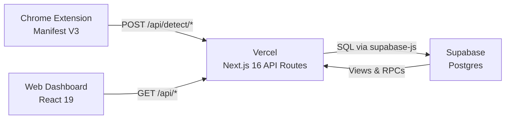

# Baloney

> Your AI content radar for the internet — personal insights for you, intelligence data for companies.

**Built at MadData26** — UW-Madison Data Science Hackathon | February 21-22, 2026

[](https://trustlens-nu.vercel.app)
[](https://nextjs.org)
[](https://supabase.com)

---

## The Problem

AI-generated images, text, and video are flooding social media, news platforms, and professional environments. Detection tools exist as scattered academic models and expensive enterprise APIs. No consumer product passively detects AI content as users browse, and no open dataset tracks the prevalence and distribution of AI-generated content across the internet.

Companies in HR, marketing, publishing, and trust & safety need quantitative data on where and how AI content appears in their ecosystems. That data does not exist today.

## Our Solution

Baloney is a **Chrome extension** + **web dashboard** that detects AI-generated content in real-time as you scroll Instagram and X. Every scan feeds a personal analytics dashboard — and with one toggle, users can opt into sharing anonymized data with a community intelligence layer.

All detection and analytics are powered by **14 Next.js API routes** (including a health monitoring endpoint) backed by **Supabase Postgres** — no separate backend server required.

**Detection** is the hook. **Analytics** is the differentiator. **Data** is the business.

## Key Features

- **Real-Time Detection** — Chrome extension scans images as you scroll Instagram and X, injecting verdict badges directly into the DOM
- **AI Slop Index** — Platform report cards with letter grades (A+ to F), 7-day and 24-hour AI rates, and trend arrows
- **Exposure Score** — Personal AI awareness gamification (0-850 scale, 5 levels: Novice to Sentinel)
- **Content Provenance** — Crowd-sourced truth via SHA-256 content hashes tracking the same content across platforms
- **Privacy by Design** — No raw content stored, community sharing opt-in with a single toggle, default OFF

## Architecture



The extension observes DOM mutations, detects images entering the viewport, sends base64 data to the API, and injects verdict badges. The dashboard reads from Supabase views for analytics, slop index, exposure scores, and content provenance.

## Tech Stack

| Layer | Technology |
|-------|-----------|
| Extension | Chrome Manifest V3, MutationObserver, IntersectionObserver |
| Frontend | Next.js 16, React 19, TypeScript 5.7, Tailwind CSS 3.4, Recharts 2.15 |
| API | Next.js API Routes (14 endpoints on Vercel) |
| Database | Supabase Postgres (6 tables, 11 views, 3 RPC functions) |
| Deployment | Vercel (frontend + API), Supabase (database) |

## Quick Start

### Web Dashboard

```bash
cd frontend
npm install
# Copy .env.local with Supabase credentials
npm run dev
```

Open [http://localhost:3000](http://localhost:3000) to view the dashboard.

### Chrome Extension

1. Open `chrome://extensions/`
2. Enable **Developer mode**
3. Click **Load unpacked** and select the `extension/` folder
4. Navigate to Instagram or X
5. Scroll — detection badges appear on images

### Seed Demo Data

```bash
curl -X POST "http://localhost:3000/api/seed?secret=YOUR_SEED_SECRET"
```

This creates 50 users, 535 scans, computes slop index and exposure scores.

## Project Structure

```
baloney/
├── frontend/                    # Next.js 16 + React 19 + Supabase
│   ├── src/
│   │   ├── app/
│   │   │   ├── api/             # 14 API routes (detection, analytics, features, health)
│   │   │   │   ├── detect/      # image + text detection
│   │   │   │   ├── analytics/   # personal + community + trends + domains
│   │   │   │   ├── scans/       # scan history
│   │   │   │   ├── sharing/     # toggle + status
│   │   │   │   ├── slop-index/  # platform report cards
│   │   │   │   ├── exposure-score/
│   │   │   │   ├── provenance/
│   │   │   │   ├── seed/        # demo data (protected)
│   │   │   │   └── health/      # system health check
│   │   │   ├── dashboard/       # 14 dashboard components
│   │   │   ├── feed/            # Demo feed with live scanning
│   │   │   ├── layout.tsx, page.tsx, globals.css
│   │   ├── components/          # 7 shared UI components
│   │   └── lib/                 # 6 utility modules (types, api, supabase, etc.)
│   ├── package.json, tsconfig.json, next.config.js, tailwind.config.js
├── extension/                   # Chrome Manifest V3
│   ├── manifest.json, content.js, background.js, popup.html, styles.css
│   └── icons/
├── docs/
│   ├── ARCHITECTURE.md          # System diagrams and design decisions
│   ├── API.md                   # Full API reference (14 endpoints)
│   ├── AI_CITATION.md           # AI tools disclosure (hackathon requirement)
│   └── PRESENTATION.md          # 5-minute pitch guide
├── .gitignore, CLAUDE.md, LICENSE
```

## Detection Accuracy

| Modality | Model / Method | Key Metric | Source |
|----------|---------------|------------|--------|
| Image | Organika/sdxl-detector | 97.3% F1, 98.1% Acc | AutoTrain validation |
| Image | AEROBLADE (theory) | 99.2% mean AP | Ricker et al., CVPR 2024 |
| Video | Per-frame aggregation | Inherits image metrics | Novel approach |
| Text | chatgpt-detector-roberta | ~95% on HC3 test set | Guo et al., arXiv 2301.07597 |
| Text | Binoculars (theory) | 90%+ TPR @ 0.01% FPR | Hans et al., ICML 2024 |

**Note:** The deployed demo uses mock detectors that return weighted random results simulating realistic distributions. Real ML inference requires GPU allocation. The feed page includes a fallback mechanism using curated ground-truth data so the demo never breaks regardless of API status.

## API Endpoints

| Method | Endpoint | Description |
|--------|----------|-------------|
| `POST` | `/api/detect/image` | Detect AI in base64 image |
| `POST` | `/api/detect/text` | Detect AI in text content |
| `GET` | `/api/analytics/personal?user_id=` | Personal AI exposure metrics |
| `GET` | `/api/analytics/community` | Aggregated community stats |
| `GET` | `/api/analytics/community/trends?days=` | Time-series AI rate |
| `GET` | `/api/analytics/community/domains?limit=` | Domain leaderboard |
| `GET` | `/api/scans/me?user_id=` | User's scan history |
| `POST` | `/api/sharing/toggle` | Enable/disable community sharing |
| `GET` | `/api/sharing/status?user_id=` | Check sharing preference |
| `GET` | `/api/slop-index` | Platform AI Slop Index |
| `GET` | `/api/exposure-score?user_id=` | Personal exposure score |
| `GET` | `/api/provenance?limit=` | Content provenance sightings |
| `POST` | `/api/seed?secret=` | Seed demo data (protected) |
| `GET` | `/api/health` | System health + Supabase connectivity |

Full API documentation: [`docs/API.md`](docs/API.md)

## Privacy Design

- **No raw content stored** — only metadata (verdict, confidence, platform, timestamp)
- **Personal data is always private** — never shared without explicit opt-in
- **Community sharing is opt-in** with a single toggle and clear copy: "We never share your identity, the content you viewed, or your browsing history — only detection verdicts and platform-level metadata."
- **Default OFF** — users must actively choose to contribute

## Key References

1. Ricker, J., Lukovnikov, D., Fischer, A. (2024). **AEROBLADE: Training-Free Detection of Latent Diffusion Images Using Autoencoder Reconstruction Error.** CVPR 2024.
2. Hans, A., Schwarzschild, A., Cherepanova, V., et al. (2024). **Spotting LLMs With Binoculars: Zero-Shot Detection of Machine-Generated Text.** ICML 2024.
3. Guo, B., Cao, X., Dong, Y., et al. (2023). **How Close is ChatGPT to Human Experts?** arXiv:2301.07597.

## Team

- **Nathaniel Garelik** — Full Stack / ML

## AI Tools Used

See [`docs/AI_CITATION.md`](docs/AI_CITATION.md) for full disclosure of AI tools used in this project, per hackathon requirements.

## License

MIT — see [`LICENSE`](LICENSE)

---

<sub>Built in 24 hours. Detection is real. Data is real. The problem isn't going away.</sub>
