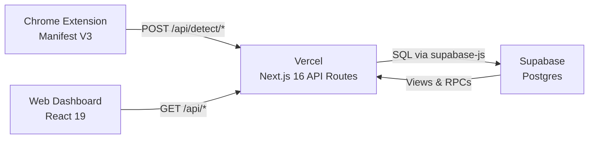
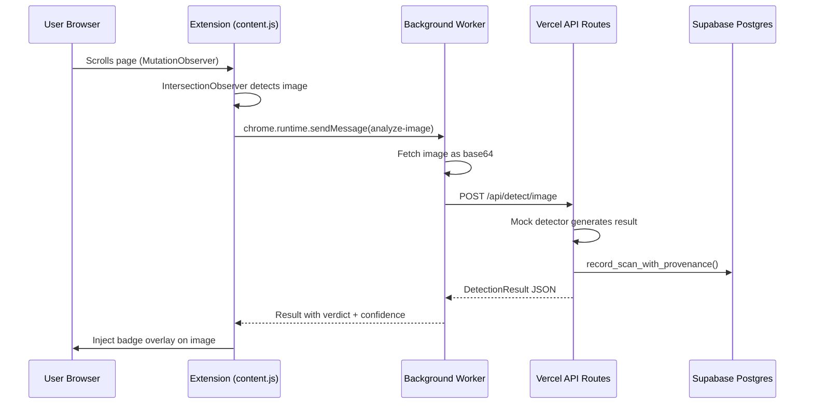
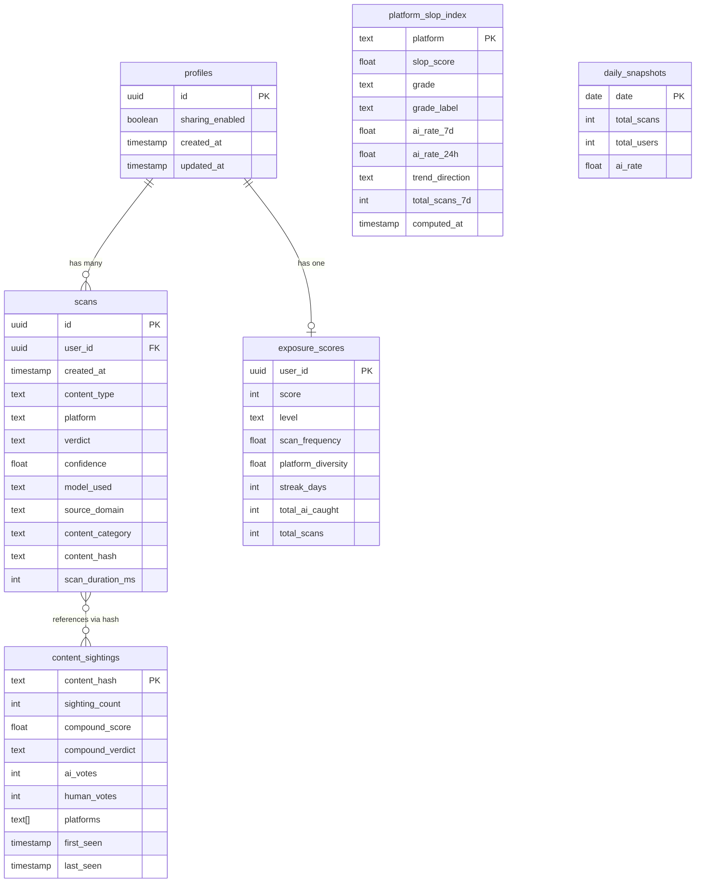
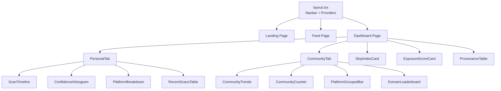

# Baloney Architecture

> System design documentation for the Baloney AI content detection platform.

## System Overview

Baloney follows a serverless architecture with three main components: a Chrome extension that passively scans content as users browse, a Next.js frontend on Vercel that serves both the dashboard UI and API routes, and Supabase Postgres that stores scans, user profiles, and aggregated analytics. There is no separate backend server.

## Data Flow

## Database Schema

### Views (11 total)

| View | Purpose |
|------|---------|
| `v_personal_stats` | Per-user total scans and AI exposure rate |
| `v_personal_by_platform` | Per-user breakdown by platform |
| `v_personal_by_content_type` | Per-user breakdown by content type |
| `v_personal_by_verdict` | Per-user breakdown by verdict |
| `v_community_stats` | Aggregate stats (sharing_enabled users only) |
| `v_community_by_platform` | Community breakdown by platform |
| `v_community_by_content_type` | Community breakdown by content type |
| `v_community_trends` | Daily AI rate over time |
| `v_domain_leaderboard` | Domains ranked by AI rate |
| `v_slop_index_latest` | Most recent slop index computation |
| `v_top_provenance` | Content hashes with most cross-platform sightings |

### RPC Functions (3)

| Function | Purpose |
|----------|---------|
| `record_scan_with_provenance(...)` | Insert scan, upsert profile, update content_sightings atomically |
| `compute_exposure_score(user_id)` | Calculate 0-850 awareness score based on frequency, diversity, streaks |
| `compute_slop_index()` | Grade platforms A+ through F based on AI detection rates |

## Component Hierarchy

## Design Decisions

### Why Supabase over custom backend?

We started with a FastAPI + SQLite backend on Railway, but migrated to Supabase Postgres for three reasons:
1. **Postgres views** — Complex analytics queries (trend aggregation, platform breakdowns, domain leaderboards) are more efficient as materialized SQL views than application-level code
2. **RPC functions** — `record_scan_with_provenance()` atomically handles scan insertion, profile upsert, and content sighting updates in a single database call
3. **Deployment simplicity** — Supabase handles hosting, backups, and connection pooling; Vercel API routes just call `supabase-js`

### Why mock detectors?

Real ML inference (Organika/sdxl-detector for images, chatgpt-detector-roberta for text) requires GPU allocation that exceeds hackathon constraints. The mock detectors in `mock-detectors.ts`:
- Return statistically realistic distributions (35% AI for images, calibrated text analysis)
- Generate real `text_stats` metrics (word count, lexical diversity, sentence length)
- Run synchronously with sub-millisecond latency
- Are functionally identical to the real pipeline from the API consumer's perspective

### Feed fallback strategy

The demo feed (`/feed`) has a double-safety net:
1. First attempts real API detection via `detectImage()`
2. On any failure (timeout, API error): falls back to curated ground-truth data from `_data.ts`
3. The demo never breaks regardless of backend status

### Content hash provenance

SHA-256 content hashes enable crowd-sourced verification:
- The same image appearing on Instagram and X produces the same hash
- Multiple independent scans build consensus (ai_votes vs human_votes)
- `compound_verdict` is derived from vote ratios, not any single scan
- No raw content is stored — only the hash and metadata

## Security Model

- **Supabase RLS**: Permissive policies (hackathon mode). Real security is enforced at the API route level.
- **Authentication**: User IDs are self-reported (extension generates UUID, stored in chrome.storage.local). No auth server.
- **Secrets**: Only `SEED_SECRET` protects the admin seed endpoint. Supabase anon key is public by design.
- **Data privacy**: No raw content stored. Scans record only metadata (verdict, confidence, platform, timestamp). Community sharing is opt-in.
- **CORS**: Handled by Vercel's default policies. Extension uses host_permissions for cross-origin image fetching.
